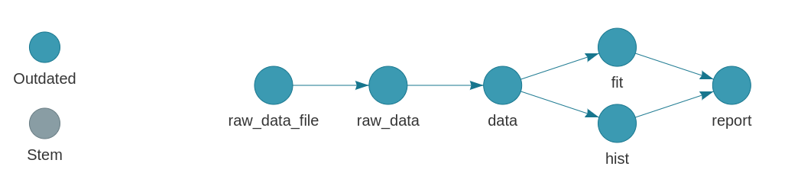

```{r, include = FALSE}
knitr::opts_chunk$set(
  collapse = TRUE,
  comment = "#>"
)
```

# `targets` package minimal example

[](https://rstudio.cloud/project/1430691)

The goal of this workflow is to assess the relationship among ozone, wind, and temperature in base R's `airquality` dataset. We get the data from a file, preprocess it, visualize it, fit a regression model, and generate an R Markdown report to communicate the results. 

## The `targets` pipeline

The [`targets`](https://github.com/wlandau/targets) R package manages the workflow. It automatically skips steps of the pipeline when the results are already up to date, which is critical for larger projects. It also helps users understand and communicate this work with tools like the interactive dependency graph below.


```{r, eval = FALSE}
library(targets)
tar_visnetwork()
```



## File structure

The files in this example are organized as follows.

```{r, eval = FALSE}
├── run.sh
├── run.R
├── _targets.R
├── sge.tmpl
├── R/
├──── functions.R
├── data/
├──── raw_data.csv
└── report.Rmd 
```

File | Purpose
---|---
`run.sh` | Shell script to run `run.R` in a persistent background process. Works on Unix-like systems. Helpful for long computations on servers.
`run.R` | R script to run `tar_make()` or `tar_make_clustermq()` (uncomment the function of your choice.)
`_targets.R` | The special R script that declares the [`targets`](https://github.com/wlandau/targets) pipeline. See `tar_script()` for details.
`sge.tmpl` | A [`clustermq`](https://github.com/mschubert/clustermq) template file to deploy targets in parallel to a Sun Grid Engine cluster.
`R/functions.R` | An R script with user-defined functions. Unlike `_targets.R`, there is nothing special about the name or location of this script. In fact, for larger projects, it is good practice to partition functions into multiple files.
`data/raw_data.csv` | The raw `airquality` dataset.
`report.Rmd` | An R Markdown report summarizing the results of the analysis. For more information on how to include R Markdown reports as reproducible components of the pipeline, see the `tar_knitr()` function and the [literate programming chapter of the manual](https://wlandau.github.io/literate.html).

## How to access

You can try out the example as long as you have a browser and an internet connection. [Click here](https://rstudio.cloud/project/1430691) to navigate your browser to an RStudio Cloud instance. No downloads or installations required.

## How to run

1. If you are running locally instead of [this RStudio cloud workspace](https://rstudio.cloud/project/1430691), install the [`targets`](https://github.com/wlandau/targets) package, as well as the packages listed in the `tar_options()` call in `_targets.R`.
1. Run the `targets` pipeline by either running `run.R` or `run.sh`. (The latter is for Unix-like systems only). This computation could take a while.
1. View the validation results in the output `report.html` file.
1. Make changes to the R code or Stan model, rerun the pipeline, and watch `targets` skip steps that are already up to date.

## High-performance computing

You can run this project locally on your laptop or remotely on a cluster. You have several choices, and they each require modifications to `run.R` and `_targets.R`.

Mode | When to use | Instructions for `run.R` | Instructions for `_targets.R`
---|---|---|---
Sequential | Low-spec local machine or Windows. | Uncomment `tar_make()` | No action required.
Local multicore | Local machine with a Unix-like OS. | Uncomment `tar_make_clustermq()` | Uncomment `options(clustermq.scheduler = "multicore")`
Sun Grid Engine | Sun Grid Engine cluster. | Uncomment `tar_make_clustermq()` | Uncomment `options(clustermq.scheduler = "sge", clustermq.template = "sge.tmpl")`
